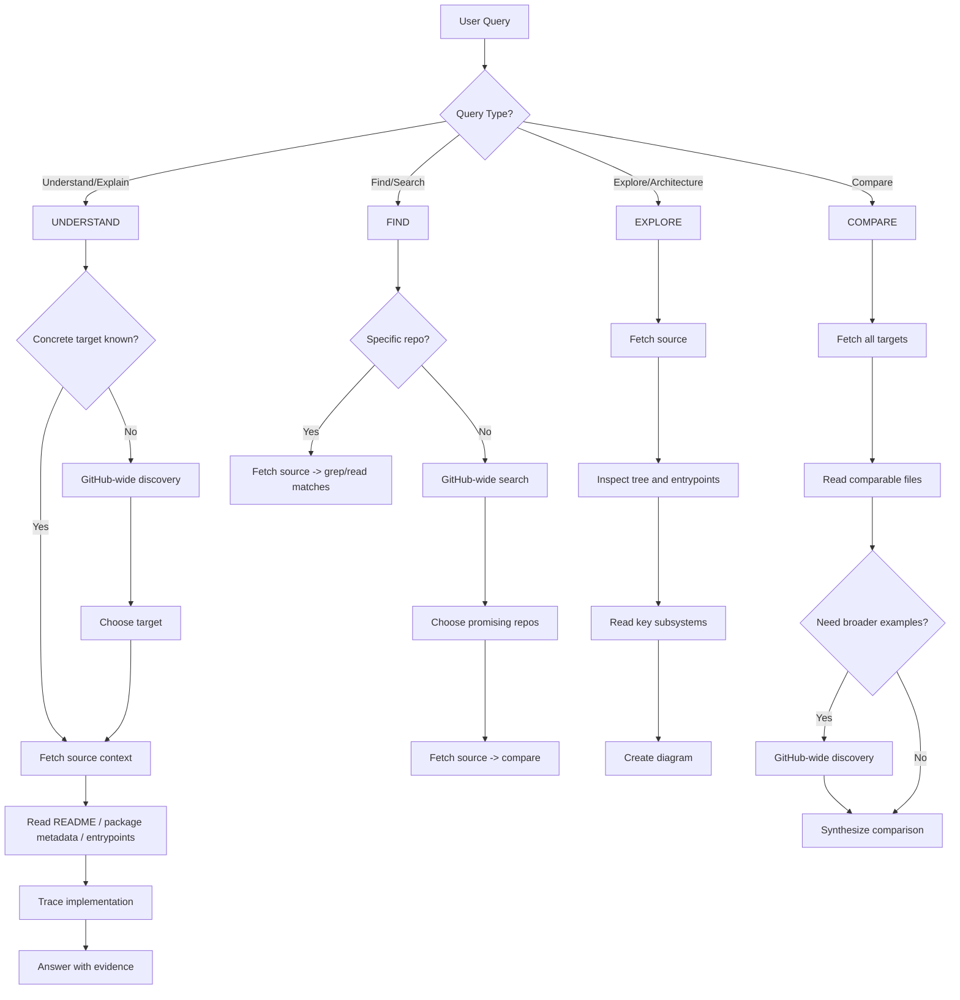

# Tool Routing

## Core Rule

Separate **discovery** from **investigation**.

- **Discovery** = identify the right package/repo or scan the ecosystem for candidate implementations.
- **Investigation** = once a concrete target is known, fetch source and answer from repo files.

Current repo mapping:

- **GitHub-wide discovery** -> `grep_app`
- **Source fetch / local inspection** -> `opensrc`

## Decision Flowchart



## Query Type Detection

| Keywords | Query Type | Start With |
|----------|------------|------------|
| "how does", "why does", "explain", "purpose of" | UNDERSTAND | Source fetch if target is known; discovery if not |
| "find", "where is", "implementations of", "examples of" | FIND | GitHub-wide discovery unless repo is already known |
| "explore", "walk through", "architecture", "structure" | EXPLORE | Source fetch |
| "compare", "vs", "difference between" | COMPARE | Source fetch |

## UNDERSTAND Queries

```
Concrete target known? -> fetch source -> read README/package metadata/entrypoints
                        -> trace implementation -> answer with evidence

Target unclear?       -> GitHub-wide discovery -> choose target -> fetch source -> investigate
```

**First source-backed stops for quick answers:**
- README
- package metadata / exports
- examples
- tests

Do not route known-library questions to a generic docs layer first.

## FIND Queries

```
Specific repo? -> fetch source -> grep/read matches

Broad search?  -> GitHub-wide discovery -> shortlist repos -> fetch source -> compare real implementations
```

**GitHub-wide discovery tips:**
- Search for literal code patterns when possible
- Add language filters when they narrow the field meaningfully
- Fetch shortlisted repos before making strong implementation claims

## EXPLORE Queries

```
1. Fetch source
2. Inspect tree to understand structure
3. Identify entry points: README, package metadata, src/index.*, exports
4. Read entry points -> internals
5. Create architecture diagram
```

## COMPARE Queries

```
1. Fetch all target libraries/repos
2. Read comparable entrypoints and implementation files
3. Use broader discovery only if extra examples materially improve the answer
4. Synthesize -> comparison table with citations
```

## Evidence Standard

For investigative answers, include when available:

- package/repo identity
- version or ref
- cited files for key claims
- code snippets for non-obvious behavior
- explicit provenance for README/examples/tests vs implementation

## Capability Mapping

| Capability | Best For | Not For |
|------------|----------|---------|
| **GitHub-wide discovery** | Broad search, unknown scope, finding candidate repos | Final implementation claims without source follow-up |
| **Source fetch / local inspection** | Deep exploration, reading internals, tracing flow | Initial ecosystem discovery when the target is unclear |

## Anti-patterns

| Don't | Do |
|-------|-----|
| Start with docs-first lookup for a known concrete target | Fetch source and read repo materials first |
| Fetch source before you know what repo/package you need | Use GitHub-wide discovery to narrow candidates |
| Make architectural claims from search results alone | Verify in fetched source |
| Describe evidence without linking files | Link every file ref |
| Use text only for complex relationships | Add a Mermaid diagram |
| Use tool names in user-facing responses | Say "I'll inspect the source" or "I'll search for implementations" |
