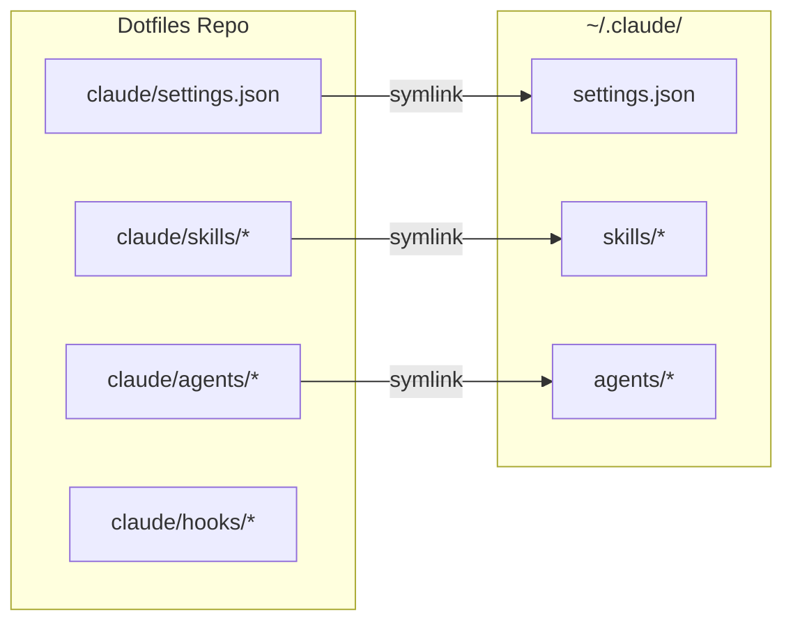

# Claude Code Skills & Agents

Custom Claude Code skills and subagents for automated agentic workflows.

## Symlink Architecture

All Claude Code configuration lives in this repo and is symlinked to `~/.claude/`:



**Key files:**
- `settings.json` → `~/.claude/settings.json` - Global permissions, hooks, plugins, MCP servers
- `skills/*/` → `~/.claude/skills/*/` - Custom slash commands
- `agents/*.md` → `~/.claude/agents/*.md` - Specialized subagents
- `hooks/` - PreToolUse hooks (referenced from settings.json)

**Installation flow:**
1. `script/bootstrap` or `bin/dot` runs all `*/install.sh` scripts
2. `claude/install.sh` symlinks settings.json and installs plugins
3. `ai/install.sh` symlinks skills and agents (single source of truth)

Edit files in the dotfiles repo, not in `~/.claude/`.

## Structure

```
claude/
├── install.sh              # Symlinks settings.json + installs plugins
├── settings.json           # Global config (permissions, hooks, MCP)
├── hooks/                  # PreToolUse hooks
│   └── safety-rm.sh        # Rewrites rm to trash
├── agents/                 # Subagents (specialized AI advisors)
│   ├── oracle.md           # Senior advisor (Opus)
│   ├── librarian.md        # Multi-repo explorer
│   └── review.md           # Code reviewer
└── skills/                 # Slash commands & capabilities
    ├── code-review/        # /code-review
    ├── prd/                # /prd
    ├── prd-task/           # /prd-task
    ├── complete-task/      # /complete-task
    ├── index-knowledge/    # /index-knowledge
    ├── session-export/     # /session-export
    ├── opensrc/            # /opensrc
    ├── dotfiles-dev/       # Dotfiles guidance
    ├── favicon-generator/  # Favicon generation
    └── qmd/                # Markdown search
```

## Subagents

Specialized AI advisors invoked via natural language:

| Agent | Model | Purpose |
|-------|-------|---------|
| **oracle** | Opus | Senior advisor for architecture, planning, complex debugging |
| **librarian** | Sonnet | Multi-repo explorer for external libraries |
| **review** | Sonnet | Code reviewer focused on bugs, security |

**Usage:**
```
Use the oracle agent to review this architecture
Use the librarian to explore how zod validates schemas
Use review to check my recent changes
```

## Slash Commands

Skills that act as commands for automated workflows:

| Command | Purpose |
|---------|---------|
| `/code-review` | Parallel code review with 3 agents |
| `/prd <feature>` | Create Product Requirements Document |
| `/prd-task <name>` | Convert PRD to executable JSON tasks |
| `/complete-task <name>` | Execute next task from PRD |
| `/index-knowledge` | Generate AGENTS.md for codebase |
| `/session-export <pr>` | Export AI session to PR description |
| `/opensrc <repo>` | Clone repo + generate knowledge base |

## Utility Skills

| Skill | Purpose |
|-------|---------|
| `dotfiles-dev` | Guidance for working with this dotfiles repo |
| `favicon-generator` | Generate optimized favicons from PNG/SVG |
| `qmd` | Hybrid markdown search (BM25 + vectors + LLM) |

## Adding New Skills

1. Create directory in `skills/`
2. Add `SKILL.md` with YAML frontmatter:
   ```yaml
   ---
   name: skill-name
   description: Brief description of what the skill does
   ---
   ```
3. Add supporting scripts/resources
4. Run `bin/dot` to symlink

## Adding New Agents

1. Create `agents/<name>.md` with frontmatter:
   ```yaml
   ---
   name: agent-name
   description: When to use this agent
   tools: Read, Grep, Glob, WebFetch
   disallowedTools: Edit, Write
   model: sonnet
   ---
   ```
2. Run `bin/dot` to symlink

## How Skills Work

Skills use "progressive disclosure" - Claude loads information in stages:
1. **Metadata**: Name and description (always loaded)
2. **Instructions**: The SKILL.md content (loaded when skill is triggered)
3. **Resources**: Supporting files/scripts (loaded as needed via bash commands)

Skills are invoked automatically by Claude when the user's request matches the skill's description.

## Plugins

Installed from official marketplaces:

| Plugin | Source | Purpose |
|--------|--------|---------|
| **document-skills** | anthropic-agent-skills | PDF, XLSX, PPTX, DOCX creation/editing |
| **playground** | claude-plugins-official | Interactive HTML playgrounds for visual collaboration |

The playground plugin generates standalone HTML files for:
- Visualizing codebase architecture
- Adjusting component design
- Brainstorming layouts
- Tweaking interactive parameters

## Installation

The `install.sh` script is automatically run by:
- `script/install` (during initial setup)
- `bin/dot` (during updates)

Or run manually:
```bash
./claude/install.sh
```

## Documentation

- [Claude Skills Overview](https://docs.claude.com/en/docs/agents-and-tools/agent-skills/overview)
- [Skills Quickstart](https://docs.claude.com/en/docs/agents-and-tools/agent-skills/quickstart)
- [Best Practices](https://docs.claude.com/en/docs/agents-and-tools/agent-skills/best-practices)
