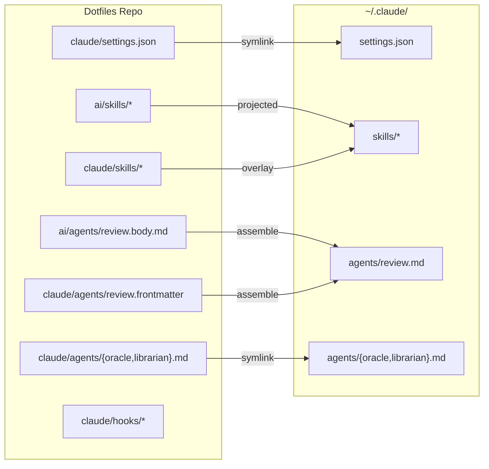

# Claude Code Skills & Agents

Claude-specific overlays, projected shared skills, and subagents for automated agentic workflows.

## Runtime Architecture

Claude runtime files now use a mix of symlinks and managed assembled outputs:


```mermaid
graph LR
    subgraph "Dotfiles Repo"
        settings["claude/settings.json"]
        shared_skills["ai/skills/*"]
        claude_skills["claude/skills/*"]
        review_body["ai/agents/review.body.md"]
        review_meta["claude/agents/review.frontmatter"]
        legacy_agents["claude/agents/{oracle,librarian}.md"]
        hooks_src["claude/hooks/*"]
    end

    subgraph "~/.claude/"
        settings_dst["settings.json"]
        skills_dst["skills/*"]
        review_dst["agents/review.md"]
        legacy_agents_dst["agents/{oracle,librarian}.md"]
    end

    settings -->|symlink| settings_dst
    shared_skills -->|projected| skills_dst
    claude_skills -->|overlay| skills_dst
    review_body -->|assemble| review_dst
    review_meta -->|assemble| review_dst
    legacy_agents -->|symlink| legacy_agents_dst
```

**Key files:**
- `settings.json` → `~/.claude/settings.json` - Global permissions, hooks, plugins, MCP servers
- `ai/skills/*` + `claude/skills/*` → `~/.claude/skills/*` - Portable skills plus Claude-specific overlays
- `ai/agents/review.body.md` + `claude/agents/review.frontmatter` → `~/.claude/agents/review.md` - Shared-body exemplar agent
- `agents/{oracle,librarian}.md` → `~/.claude/agents/{oracle,librarian}.md` - Legacy combined subagents pending migration
- `hooks/` - PreToolUse, Stop, and Notification hooks (referenced from settings.json)

**Installation flow:**
1. `script/bootstrap` or `bin/dot` runs all `*/install.sh` scripts
2. `claude/install.sh` symlinks settings.json and installs plugins
3. `ai/install.sh` projects shared skills from `ai/skills/`, applies `claude/skills/` overlays, assembles `review`, and symlinks the remaining legacy agents

Author portable skills in `ai/skills/`, keep `claude/skills/` for Claude-native overlays, and edit repo files rather than `~/.claude/`.

## Structure

```
ai/
├── agents/
│   └── review.body.md      # Shared review body
└── skills/                 # Portable skills projected into ~/.claude/skills
    ├── sprint-plan/        # Shared sprint planning
    ├── qmd/                # Markdown search
    ├── favicon-generator/  # Favicon generation
    └── workspace-snapshot/ # Quick workspace orientation

claude/
├── install.sh              # Symlinks settings.json + installs plugins
├── settings.json           # Global config (permissions, hooks, MCP)
├── hooks/                  # Lifecycle hooks
│   ├── safety-rm.sh        # PreToolUse: rewrites rm to trash
│   └── notify-idle.sh      # Stop/Notification: sound + macOS alert
├── agents/                 # Subagents (specialized AI advisors)
│   ├── oracle.md           # Legacy combined agent (Opus)
│   ├── librarian.md        # Legacy combined agent
│   └── review.frontmatter  # Shared-body exemplar metadata
└── skills/                 # Claude-only overlays
    ├── build-skill/        # /build-skill
    ├── code-review/        # /code-review
    ├── dotfiles-dev/       # Dotfiles guidance
    ├── index-knowledge/    # /index-knowledge
    ├── librarian/          # Librarian helper skill
    ├── opensrc/            # /opensrc
    └── session-export/     # /session-export
```

## Subagents

Specialized AI advisors invoked via natural language:

| Agent | Model | Purpose |
|-------|-------|---------|
| **oracle** | Opus | Senior advisor for architecture, planning, complex debugging |
| **librarian** | Sonnet | Multi-repo explorer for external libraries |
| **review** | Sonnet | Code reviewer focused on bugs, security |

**Usage:**
```
Use the oracle agent to review this architecture
Use the librarian to explore how zod validates schemas
Use review to check my recent changes
```

## Slash Commands

Skills that act as commands for automated workflows:

| Command | Purpose |
|---------|---------|
| `/code-review` | Parallel code review with 3 agents |
| `/prd <feature>` | Create Product Requirements Document |
| `/prd-task <name>` | Convert PRD to executable JSON tasks |
| `/complete-task <name>` | Execute next task from PRD |
| `/index-knowledge` | Generate AGENTS.md for codebase |
| `/session-export <pr>` | Export AI session to PR description |
| `/opensrc <repo>` | Clone repo + generate knowledge base |

## Utility Skills

| Skill | Purpose |
|-------|---------|
| `dotfiles-dev` | Guidance for working with this dotfiles repo |
| `favicon-generator` | Generate optimized favicons from PNG/SVG |
| `qmd` | Hybrid markdown search (BM25 + vectors + LLM) |

## Adding New Skills

1. Create directory in `skills/`
2. Add `SKILL.md` with YAML frontmatter:
   ```yaml
   ---
   name: skill-name
   description: Brief description of what the skill does
   ---
   ```
3. Add supporting scripts/resources
4. Run `bin/dot` to symlink

## Adding New Agents

Prefer the shared-body pattern for new portable agents:

1. Create `ai/agents/<name>.body.md` with the neutral agent instructions.
2. Create `claude/agents/<name>.frontmatter` with Claude-specific metadata:
   ```yaml
   name: agent-name
   description: When to use this agent
   tools: Read, Grep, Glob, WebFetch
   disallowedTools: Edit, Write
   model: sonnet
   ```
3. Run `bin/dot` to assemble the installed runtime file.

`oracle` and `librarian` still use the older combined `agents/<name>.md` format until they are migrated.

## How Skills Work

Skills use "progressive disclosure" - Claude loads information in stages:
1. **Metadata**: Name and description (always loaded)
2. **Instructions**: The SKILL.md content (loaded when skill is triggered)
3. **Resources**: Supporting files/scripts (loaded as needed via bash commands)

Skills are invoked automatically by Claude when the user's request matches the skill's description.

## Plugins

Installed from official marketplaces:

| Plugin | Source | Purpose |
|--------|--------|---------|
| **document-skills** | anthropic-agent-skills | PDF, XLSX, PPTX, DOCX creation/editing |
| **playground** | claude-plugins-official | Interactive HTML playgrounds for visual collaboration |

The playground plugin generates standalone HTML files for:
- Visualizing codebase architecture
- Adjusting component design
- Brainstorming layouts
- Tweaking interactive parameters

## Installation

The `install.sh` script is automatically run by:
- `script/install` (during initial setup)
- `bin/dot` (during updates)

Or run manually:
```bash
./claude/install.sh
```

## Documentation

- [Claude Skills Overview](https://docs.claude.com/en/docs/agents-and-tools/agent-skills/overview)
- [Skills Quickstart](https://docs.claude.com/en/docs/agents-and-tools/agent-skills/quickstart)
- [Best Practices](https://docs.claude.com/en/docs/agents-and-tools/agent-skills/best-practices)
